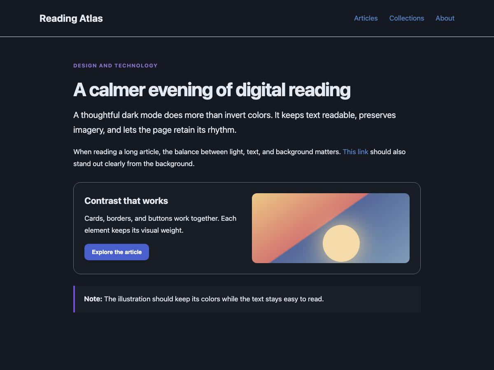
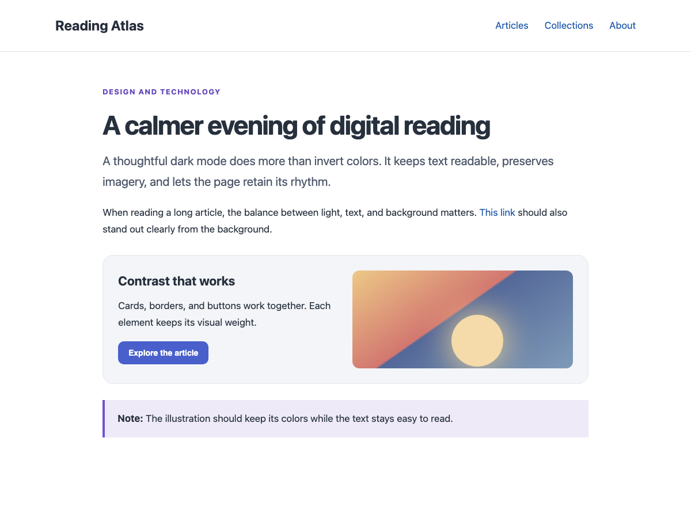

# LumaShade

A calm, readable dark mode for Safari. LumaShade darkens bright websites and adjusts text and links for contrast. It leaves photos, videos, canvas, and embedded content untouched, and steps aside when a website already has a dark theme.



| Before | After |
| --- | --- |
|  |  |

The screenshots show the same [sample page](Tests/sample.html) before and after applying LumaShade in a browser preview.

## Features

- Turn dark mode on or off globally, with a separate switch for each website.
- Transform bright surfaces and their text together. The target contrast for normal text is **at least 4.5:1**.
- Detect existing dark themes and leave them alone.
- Adapt content added after a page loads.
- Keep single-color SVG wordmarks and icons readable without recoloring multicolor artwork.
- Make search and form placeholders legible on dark surfaces.
- Preserve the original colors of photos and videos.
- No account, server, ads, or tracking. Preferences stay in the browser's local storage.

## Install in Safari

1. Open [LumaShade.xcodeproj](LumaShade/LumaShade.xcodeproj) in Xcode.
2. Select your Apple development team under **Signing & Capabilities** for both the `LumaShade` and `LumaShade Extension` targets.
3. Select the `LumaShade` scheme and `My Mac` destination, then click **Run**.
4. In the app, click **Open Safari Extension Settings**. Enable LumaShade under **Safari Settings → Extensions** and allow access to websites.
5. Refresh any open tabs you want to darken. Use the LumaShade toolbar icon to manage the global and per-site switches.

Safari's internal pages and pages that do not allow extensions remain unchanged. If a particular website renders unusually, turn LumaShade off for that site.

## Development

The extension source is in [`Extension/`](Extension/). The Xcode project references these files directly, so there is no second copy to keep in sync.

The [contrast regression page](Tests/regression.html) checks a dark wordmark, a search placeholder, multicolor artwork, and unchanged element geometry. Its [rendered preview](Screenshots/contrast-regression.png) is a test fixture, not a screenshot of Medium.

```sh
node --test Tests/colors.test.js
xcodebuild -project LumaShade/LumaShade.xcodeproj -scheme LumaShade -configuration Debug -derivedDataPath build CODE_SIGNING_ALLOWED=NO build
```

The screenshots use a sample page; results on individual websites may vary. Released under the [MIT license](LICENSE).
